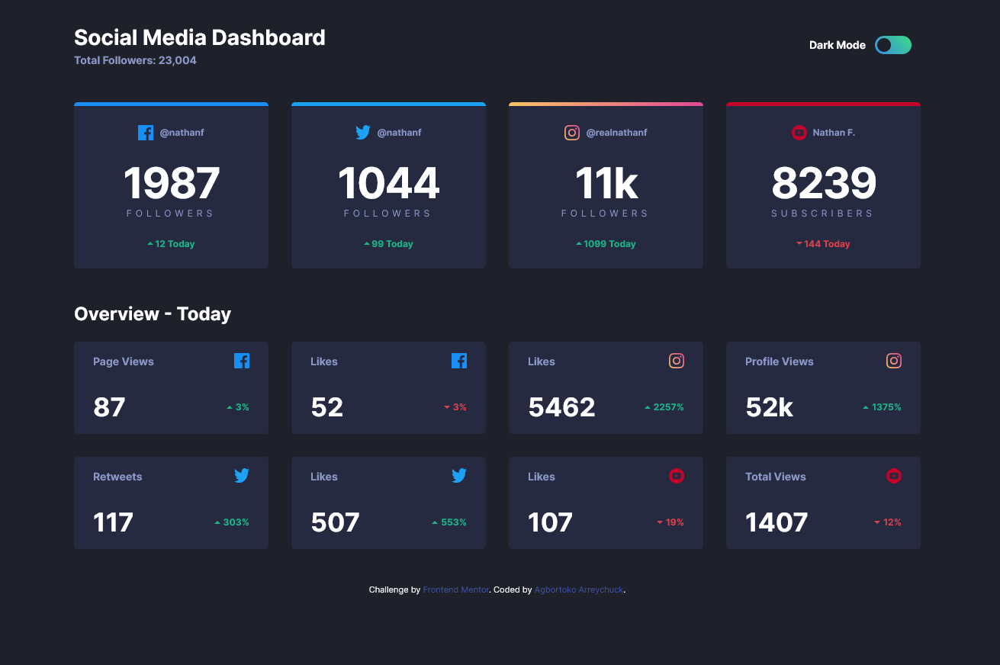

# Frontend Mentor - Social media dashboard with theme switcher solution

This is a solution to the [Social media dashboard with theme switcher challenge on Frontend Mentor](https://www.frontendmentor.io/challenges/social-media-dashboard-with-theme-switcher-6oY8ozp_H). Frontend Mentor challenges help you improve your coding skills by building realistic projects. 

## Table of contents

- [Frontend Mentor - Social media dashboard with theme switcher solution](#frontend-mentor---social-media-dashboard-with-theme-switcher-solution)
  - [Table of contents](#table-of-contents)
  - [Overview](#overview)
    - [The challenge](#the-challenge)
    - [Screenshot](#screenshot)
    - [Links](#links)
  - [My process](#my-process)
    - [Built with](#built-with)
    - [What I learned](#what-i-learned)
    - [Continued development](#continued-development)
    - [Useful resources](#useful-resources)
  - [Author](#author)
  - [Acknowledgments](#acknowledgments)


## Overview

### The challenge

Users should be able to:

- View the optimal layout for the site depending on their device's screen size
- See hover states for all interactive elements on the page
- Toggle color theme to their preference

### Screenshot




### Links

- Solution URL: [Solution URL](https://github.com/Agbortoko/fem-social-media-dashboard-dark-light-toggle)
- Live Site URL: [Live Site URL](https://agbortoko.github.io/fem-social-media-dashboard-dark-light-toggle/)

## My process

### Built with

- Semantic HTML5 markup
- CSS custom properties
- Flexbox
- CSS Grid
- Mobile-first workflow
- [SASS](https://sass-lang.com/documentation/)
- [BEM](https://getbem.com/)
- Vanilla JavaScript


### What I learned

Use this section to recap over some of your major learnings while working through this project. Writing these out and providing code samples of areas you want to highlight is a great way to reinforce your own knowledge.

To see how you can add code snippets, see below:

```html
<h1>Some HTML code I'm proud of</h1>
```
```css
.proud-of-this-css {
  color: papayawhip;
}
```
```js
const proudOfThisFunc = () => {
  console.log('🎉')
}
```

If you want more help with writing markdown, we'd recommend checking out [The Markdown Guide](https://www.markdownguide.org/) to learn more.

**Note: Delete this note and the content within this section and replace with your own learnings.**

### Continued development

- Accessibility
- Practice making Awesome UI elements with HTML, CSS and JS
- Understand more about Semantic HTML


### Useful resources

- [MDN Prefers Color Scheme CSS Notes](https://developer.mozilla.org/en-US/docs/Web/CSS/@media/prefers-color-scheme) - This helped me understand a little bit more about the prefers color scheme
- [scottaohara Github notes]( https://scottaohara.github.io/a11y_styled_form_controls/src/radio-button--switch/) - I understood more about the proper way to comeup with good html structure of radio buttons. The html structure proposed not only works well it is also functions well for accessibility
- [Accessbility Developer Guide](https://www.accessibility-developer-guide.com/) - This is pretty much one of the concepts which i normally ignore, but reading through this website made me understand the importance. So i try my best to focus a little more an Accessibility.
- [SASS Documentation](https://sass-lang.com/documentation/) - Since i currently work a lot with SASS this came in quite handy. I almost always forgot certain aspects, so i checked the documentation to get more info.
  


## Author

- Website - [RabbitMaid](https://www.rabbitmaid.com) Under Dev
- Frontend Mentor - [@Agbortoko](https://www.frontendmentor.io/profile/Agbortoko)
- Twitter - [@agbortoko_arrey](https://www.twitter.com/agbortoko_arrey)


## Acknowledgments

I Acknowledge TheCodeCoder [YouTube Channel](https://www.youtube.com/@thecodercoder)
I learnt a lot about Web design from her YouTube Videos

